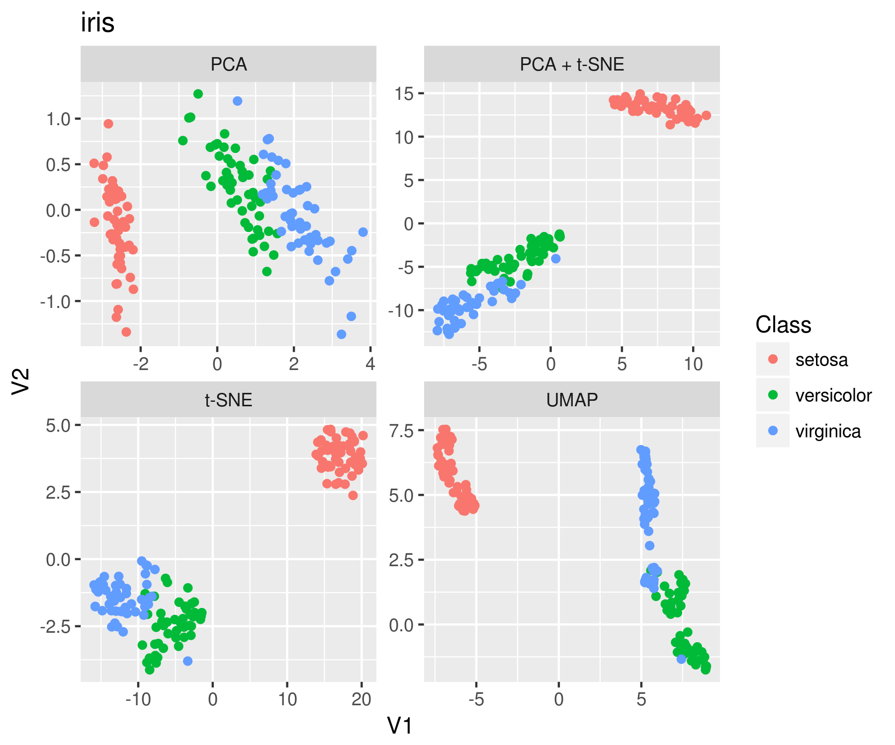
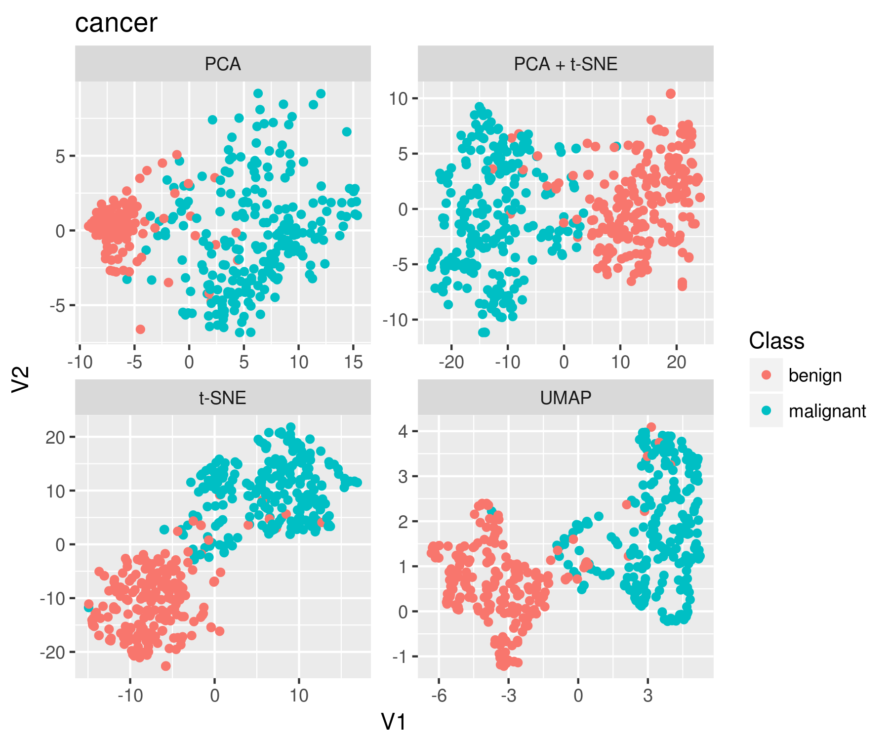
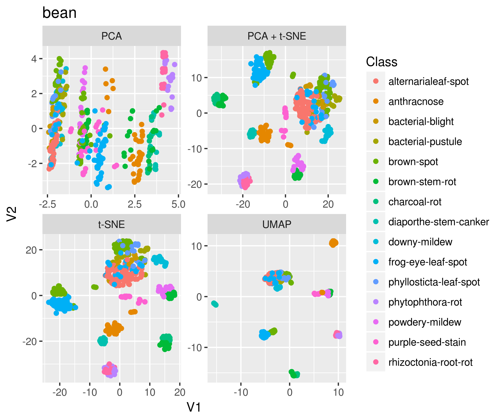
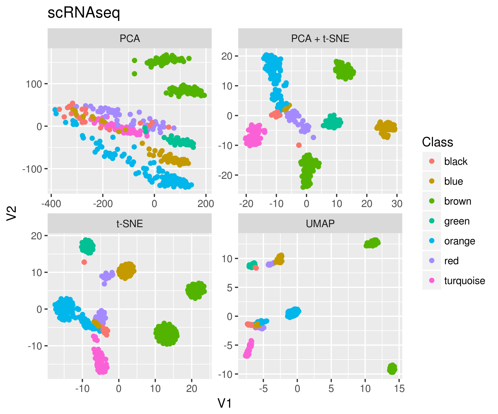
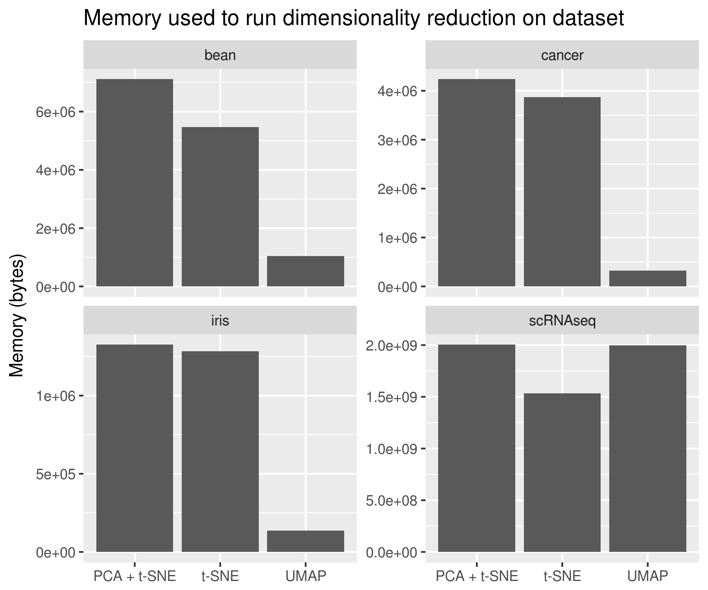

<!-- README.md is generated from README.Rmd. Please edit that file -->

```{r, echo = FALSE}
knitr::opts_chunk$set(
  collapse = TRUE,
  comment = "#>",
  fig.path = "img/"
)
library(bindrcpp)
```

# umapr

[](https://travis-ci.org/ropenscilabs/umapr)

`umapr` wraps the Python implementation of UMAP to make the algorithm accessible from within R. It uses the great [`reticulate`](https://cran.r-project.org/web/packages/reticulate/index.html) package.

Uniform Manifold Approximation and Projection (UMAP) is a non-linear dimensionality reduction algorithm. It is similar to t-SNE but computationally more efficient. UMAP was created by Leland McInnes and John Healy ([github](https://github.com/lmcinnes/umap), [arxiv](https://arxiv.org/abs/1802.03426)). 

## Contributors 

[Angela Li](https://github.com/angela-li), [Ju Kim](https://github.com/juyeongkim), [Malisa Smith](https://github.com/malisas), [Sean Hughes](https://github.com/seaaan), [Ted Laderas](https://github.com/laderast)

## Installation

**First**, you will need to install `Python` and the `UMAP` package. Instruction available [here](https://github.com/lmcinnes/umap#installing).

Then, you can install the development version from [GitHub](https://github.com/) with:

``` r
# install.packages("devtools")
devtools::install_github("ropenscilabs/umapr")
```

## Basic use

Here is an example of running UMAP on the `iris` data set. 

```{r message=FALSE, warning=FALSE, fig.width=7}
library(umapr)
library(tidyverse)

# select only numeric columns
df <- iris[ , 1:4]

# run UMAP algorithm
embedding <- umap(df)
```

`umap` returns a `data.frame` with two attached columns called "UMAP1" and "UMAP2". These columns represent the UMAP embeddings of the data, which are column-bound to the original data frame. 

```{r}
# look at result
head(embedding)

# plot the result
embedding %>% 
  mutate(Species = iris$Species) %>%
  ggplot(aes(UMAP1, UMAP2, color = Species)) + geom_point()
```

There is a function called `run_umap_shiny()` which will bring up a Shiny app for exploring different colors of the variables on the umap plots.

```{r eval=FALSE}
run_umap_shiny(embedding)
```


## Function parameters

There are a few important parameters. These are fully described in the UMAP Python [documentation](https://github.com/lmcinnes/umap/blob/bf1c3e5c89ea393c9de10bd66c5e3d9bc30588ee/notebooks/UMAP%20usage%20and%20parameters.ipynb). 

The `n_neighbor` argument can range from 2 to n-1 where n is the number of rows in the data.
 
```{r fig.width=7}
neighbors <- c(4, 8, 16, 32, 64, 128)

neighbors %>% 
  map_df(~umap(iris[,1:4], n_neighbors = .x) %>% 
      mutate(Species = iris$Species, Neighbor = .x)) %>% 
  mutate(Neighbor = as.integer(Neighbor)) %>% 
  ggplot(aes(UMAP1, UMAP2, color = Species)) + 
    geom_point() + 
    facet_wrap(~ Neighbor, scales = "free")
```

The `min_dist` argument can range from 0 to 1. 

```{r fig.width=7}
dists <- c(0.001, 0.01, 0.05, 0.1, 0.5, 0.99)

dists %>% 
  map_df(~umap(iris[,1:4], min_dist = .x) %>% 
      mutate(Species = iris$Species, Distance = .x)) %>% 
  ggplot(aes(UMAP1, UMAP2, color = Species)) + 
    geom_point() + 
    facet_wrap(~ Distance, scales = "free")
```

The `distance` argument can be many different distance functions. 

```{r fig.width=7}
dists <- c("euclidean", "manhattan", "canberra", "cosine", "hamming", "dice")

dists %>% 
  map_df(~umap(iris[,1:4], metric = .x) %>% 
      mutate(Species = iris$Species, Metric = .x)) %>% 
  ggplot(aes(UMAP1, UMAP2, color = Species)) + 
    geom_point() + 
    facet_wrap(~ Metric, scales = "free")
```

## Comparison to t-SNE and principal components analysis

t-SNE and UMAP are both non-linear dimensionality reduction methods, in contrast to PCA. Because t-SNE is relatively slow, PCA is sometimes run first to reduce the dimensions of the data. 

We compared UMAP to PCA and t-SNE alone, as well as to t-SNE run on data preprocessed with PCA. In each case, the data were subset to include only complete observations. The code to reproduce these findings are available in [`timings.R`](timings.R). 

The first data set is the same iris data set used above (149 observations of 4 variables): 



Next we tried a cancer data set, made up of 699 observations of 10 variables: 



Third we tried a soybean data set. It is made up of 531 observations and 35 variables: 



Finally we used a large single-cell RNAsequencing data set, with 561 observations (cells) of 55186 variables (over 30 million elements)! 



PCA is orders of magnitude faster than t-SNE or UMAP (not shown). UMAP, though, is a substantial improvement over t-SNE both in terms of memory and time taken to run. 




## Related projects

* [`umap`](https://github.com/tkonopka/umap): R implementation of UMAP
* [`seurat`](https://github.com/satijalab/seurat): R toolkit for single cell genomics
* [`smallvis`](https://github.com/jlmelville/smallvis): R package for dimensionality reduction of small datasets
