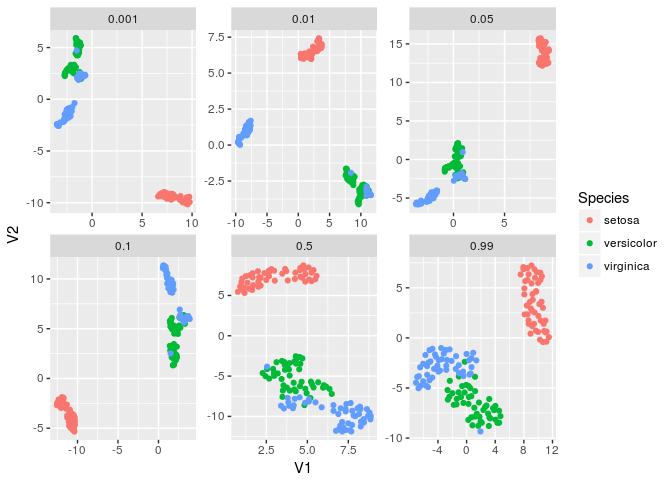
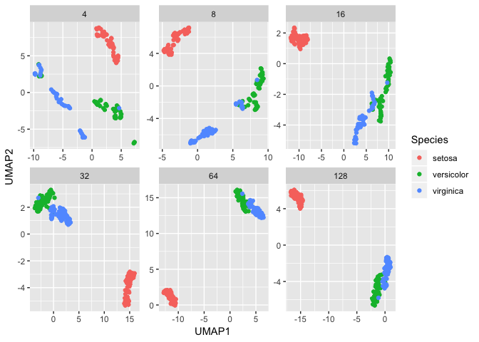
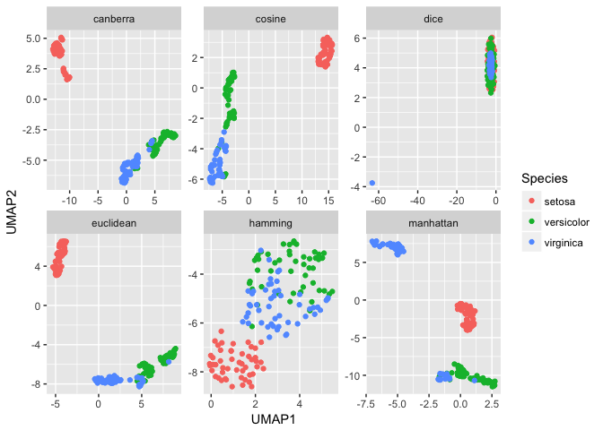

<!-- README.md is generated from README.Rmd. Please edit that file -->
umapr
=====

[](https://travis-ci.org/ropenscilabs/umapr)

Uniform Manifold Approximation and Projection (UMAP) is a non-linear dimensionality reduction algorithm. It is similar to t-SNE but computationally more efficient. UMAP was created by Leland McInnes and John Healy ([github](https://github.com/lmcinnes/umap), [arxiv](https://arxiv.org/abs/1802.03426)). `umapr` wraps the Python implementation of UMAP to make the algorithm accessible from within R.

Basic use
---------

Here is an example of running UMAP on the `iris` data set.

``` r
library(umapr)
library(tidyverse)
#> Loading tidyverse: ggplot2
#> Loading tidyverse: tibble
#> Loading tidyverse: tidyr
#> Loading tidyverse: readr
#> Loading tidyverse: purrr
#> Loading tidyverse: dplyr
#> Conflicts with tidy packages ----------------------------------------------
#> filter(): dplyr, stats
#> lag():    dplyr, stats
# select only numeric columns
embedding <- umap(as.matrix(iris[ , 1:4]))

# look at result
head(embedding$returnData())
#>   Sepal.Length Sepal.Width Petal.Length Petal.Width    UMAP1    UMAP2
#> 1          5.1         3.5          1.4         0.2 3.395519 6.935016
#> 2          4.9         3.0          1.4         0.2 2.440003 8.695651
#> 3          4.7         3.2          1.3         0.2 2.033388 8.096085
#> 4          4.6         3.1          1.5         0.2 1.893995 8.265538
#> 5          5.0         3.6          1.4         0.2 3.049449 6.708510
#> 6          5.4         3.9          1.7         0.4 3.919869 5.949295

#plot the result
embedding$plot("Petal.Length")
```


`umap` returns an R6 object, which contains a data frame two columns called("UMAP1","UMAP2") containing the UMAP embeddings of the original data and the original data attached. To get the actual output as a `data.frame`, use the `$returnData()` method attached to the R6 object.

The R6 object also includes an `$explore()` method, which will bring up a Shiny app for exploring coloring the different variables on the umap plots.

``` r

embedding$explore()
```

There are a few important parameters. These are fully described in the UMAP Python [documentation](https://github.com/lmcinnes/umap/blob/bf1c3e5c89ea393c9de10bd66c5e3d9bc30588ee/notebooks/UMAP%20usage%20and%20parameters.ipynb).

The `n_neighbor` argument can range from 2 to n-1 where n is the number of rows in the data.

``` r
neighbors <- c(4, 8, 16, 32, 64, 128)

f <- lapply(neighbors, function(neighbor) {
  iris_result <- umap(as.matrix(iris[,1:4]), n_neighbors = as.integer(neighbor))
 
  cbind(iris_result$returnData(), Species=iris$Species)
})

names(f) <- neighbors

bind_rows(f, .id = "Neighbor") %>% 
  mutate(Neighbor = as.integer(Neighbor)) %>% 
  ggplot(aes(UMAP1, UMAP2, color = Species)) + geom_point() + 
  facet_wrap(~ Neighbor, scales = "free")
```



The `min_dist` argument can range from 0 to 1.

``` r
dists <- c(0.001, 0.01, 0.05, 0.1, 0.5, 0.99)

f <- lapply(dists, function(dist) {
  iris_result <- umap(as.matrix(iris[,1:4]), min_dist = dist)
  cbind(iris_result$returnData(), Species=iris$Species)
})

names(f) <- dists

bind_rows(f, .id = "Distance") %>% 
  ggplot(aes(UMAP1, UMAP2, color = Species)) + geom_point() + 
  facet_wrap(~ Distance, scales = "free")
```



The `distance` argument can be a bunch of stuff.

``` r
dists <- c("euclidean", "manhattan", "canberra", "cosine", "hamming", "dice")

f <- lapply(dists, function(dist) {
  iris_result <- umap(as.matrix(iris[,1:4]), metric = dist)
  cbind(iris_result$returnData(), Species=iris$Species)
})

names(f) <- dists

bind_rows(f, .id = "Metric") %>% 
  ggplot(aes(UMAP1, UMAP2, color = Species)) + geom_point() + 
  facet_wrap(~ Metric, scales = "free")
```


