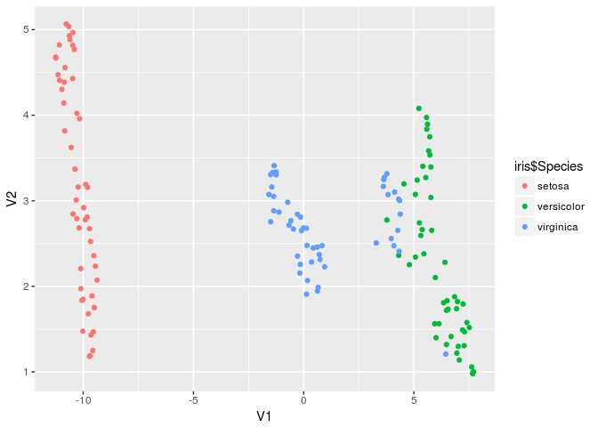

<!-- README.md is generated from README.Rmd. Please edit that file -->
umapr
=====

[](https://travis-ci.org/ropenscilabs/umapr)

`umapr` makes it easy to run [UMAP](https://github.com/lmcinnes/umap) from R. UMAP was created by Leland McInnes and John Healy ([arxiv](https://arxiv.org/abs/1802.03426)).

Installation
------------

You can install umapr from github with:

``` r
# install.packages("devtools")
devtools::install_github("ropenscilabs/umapr")
```

Here is an example of running UMAP on the `iris` data set.

``` r
library(umapr)
# select only numeric columns
embedding <- as.data.frame(umap(as.matrix(iris[ , 1:4])))

# look at result
head(embedding)
#>           V1       V2
#> 1 -10.184218 2.682828
#> 2 -10.651983 5.034732
#> 3 -10.969165 4.301109
#> 4 -10.827896 4.555806
#> 5 -10.291350 2.792164
#> 6  -9.764767 1.678716

# plot result
library(ggplot2)
ggplot(embedding, aes(x = V1, y = V2, color = iris$Species)) + 
  geom_point()
```



See the vignette for more detailed examples.
